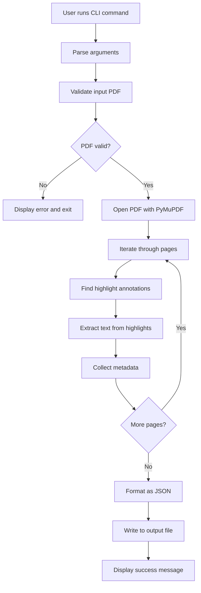

# Highext - Architecture Plan

## Project Overview

A Python CLI/TUI tool that extracts highlighted text from PDF files and outputs the results in multiple formats (JSON, XMind, Notion Markdown) with metadata including page numbers, highlight colors, and coordinates.

## Technical Requirements

- **Python Version**: 3.12+
- **Interface**: Command-line interface (CLI) and Text User Interface (TUI)
- **Output Format**: JSON, XMind, Notion-compatible Markdown
- **Primary Library**: PyMuPDF (fitz) - chosen for its robust annotation handling and performance

## Project Structure

```
highext/
├── src/
│   ├── __init__.py
│   ├── extractor.py          # Core extraction logic
│   ├── cli.py                # CLI interface and argument parsing
│   ├── tui.py                # Text User Interface (Textual)
│   ├── xmind_exporter.py     # XMind export logic
│   ├── notion_exporter.py    # Notion/Markdown export logic
│   └── utils.py              # Helper functions (JSON formatting, validation, grouping)
├── tests/
│   ├── __init__.py
│   ├── test_extractor.py     # Unit tests for extraction logic
│   └── test_cli.py           # Tests for CLI interface
├── examples/
│   ├── sample.pdf            # Example PDF with highlights
│   └── expected_output.json  # Expected extraction result
├── requirements.txt          # Project dependencies
├── README.md                 # Documentation
├── .gitignore               # Git ignore file
└── setup.py                 # Package setup (optional)
```

## Core Components

### 1. PDF Annotation Extractor ([`extractor.py`](src/extractor.py))

**Responsibilities:**
- Open and parse PDF files using PyMuPDF
- Identify highlight annotations (type: 'Highlight')
- Extract text content from highlighted regions
- Collect metadata (page number, color, coordinates)

**Key Functions:**
- `extract_highlights(pdf_path: str) -> list[dict]`
  - Main extraction function
  - Returns list of highlight dictionaries
  
- `get_highlight_text(page, annot) -> str`
  - Extracts text from a specific highlight annotation
  - Handles multi-line highlights
  
- `get_annotation_metadata(page_num, annot) -> dict`
  - Extracts color, coordinates, and other metadata

**Data Structure (per highlight):**
```json
{
  "page": 1,
  "text": "highlighted text content",
  "color": [1.0, 1.0, 0.0],
  "color_name": "yellow",
  "rect": [x0, y0, x1, y1],
  "author": "optional author name",
  "created": "optional timestamp"
}
```

### 2. CLI Interface ([`cli.py`](src/cli.py))

**Responsibilities:**
- Parse command-line arguments
- Validate input file paths
- Call extraction logic
- Handle output file writing (JSON, XMind, Notion)
- Display progress and results

**Command Structure:**
```bash
highext-cli <input_pdf> -f <format> -o <output_file> [options]

Options:
  -f, --format {json,xmind,notion}  Format of the output file (required)
  -o, --output PATH                 Path to the output file (required)
  -v, --verbose                     Enable verbose logging
  --group-by {page,color}           Organize highlights by page or color (default: page)
```

**Argument Parsing:**
- Use `argparse` module
- Required: `input_pdf`, `format`, `output`
- Optional: `verbose`, `group-by`

### 3. TUI Interface ([`tui.py`](src/tui.py))

**Responsibilities:**
- Provide interactive file browsing
- Configure export options via UI
- Display extraction logs and preview
- Handle cross-platform navigation

**Features:**
- File tree navigation with ".." support
- Group By selection (Page/Color)
- Real-time preview of extracted content **with rich text coloring** matching PDF highlights
- **Escapable Input** for better keyboard navigation

### 4. Exporters

**XMind Exporter ([`xmind_exporter.py`](src/xmind_exporter.py)):**
- Creates `.xmind` files (ZIP archive with XML content)
- Supports grouping by Page or Color (with Page hierarchy)
- **Robust styling** with redundant color properties for compatibility

**Notion Exporter ([`notion_exporter.py`](src/notion_exporter.py)):**
- Creates Markdown files optimized for Notion import
- Supports grouped structure (Page > Color or Color > Page)
- **Colored Text** using HTML spans (`<span style="color: ...">`) for visual fidelity

### 5. Utilities ([`utils.py`](src/utils.py))

**Responsibilities:**
- JSON formatting and serialization
- Grouping logic (`group_highlights`)
- Color conversion (RGB to color names, RGB to HEX)
- File validation
- Error message formatting

**Key Functions:**
- `format_json_output(highlights: list, pretty: bool) -> str` (Note: `pretty` is now always True)
- `rgb_to_color_name(rgb: tuple) -> str` (Standardized names with saturation check)
- `rgb_to_hex(rgb: tuple) -> str`
- `validate_pdf_file(path: str) -> bool`

## Technical Implementation Details

### PyMuPDF (fitz) Usage

```python
import fitz  # PyMuPDF

# Open PDF
doc = fitz.open(pdf_path)

# Iterate through pages
for page_num, page in enumerate(doc, start=1):
    # Get annotations
    for annot in page.annots():
        # Check if it's a highlight
        if annot.type[0] == 8:  # 8 = Highlight annotation
            # Extract text from highlighted area
            rect = annot.rect
            text = page.get_text("text", clip=rect)
            
            # Get color
            color = annot.colors.get("stroke", [0, 0, 0])
```

### Error Handling Strategy

1. **File Not Found**: Clear error message with file path
2. **Invalid PDF**: Catch PyMuPDF exceptions, suggest file repair
3. **No Highlights Found**: Return empty list with informative message
4. **Permission Errors**: Handle read/write permission issues
5. **Corrupted Annotations**: Skip and log problematic annotations

### Logging Strategy

- Use Python's `logging` module
- Levels:
  - INFO: File processing, highlights found count
  - DEBUG: Individual annotation details
  - WARNING: Skipped annotations, potential issues
  - ERROR: Critical failures

## Workflow Diagram



## Data Flow


## Dependencies

### Core Dependencies
- **PyMuPDF** (fitz): PDF parsing and annotation extraction
- **argparse**: CLI argument parsing (built-in)
- **json**: JSON output formatting (built-in)
- **logging**: Logging functionality (built-in)

### Development Dependencies
- **pytest**: Unit testing framework
- **pytest-cov**: Code coverage reporting
- **black**: Code formatting
- **flake8**: Linting

## Testing Strategy

### Unit Tests
1. Test extraction with sample PDFs containing:
   - Single highlights
   - Multiple highlights on one page
   - Highlights across multiple pages
   - Different highlight colors
   - Overlapping highlights

2. Test edge cases:
   - Empty PDF (no highlights)
   - Corrupted annotations
   - Very large PDFs
   - PDFs with other annotation types

3. Test CLI:
   - Argument parsing
   - File validation
   - Output file creation

### Test Data
- Create minimal test PDFs programmatically
- Include various highlight scenarios
- Store expected outputs for comparison

## Usage Examples

### Export to JSON
```bash
highext-cli document.pdf -f json -o highlights.json
```

### Export to XMind
```bash
highext-cli document.pdf -f xmind -o results/mindmap.xmind
```

### Verbose Mode with Notion Export
```bash
highext-cli document.pdf -f notion -o notes.md -v
```

## Expected JSON Output Format

```json
{
  "source_file": "document.pdf",
  "extraction_date": "2026-01-31T21:00:00Z",
  "total_highlights": 3,
  "highlights": [
    {
      "page": 1,
      "text": "This is highlighted text",
      "color": [1.0, 1.0, 0.0],
      "color_name": "yellow",
      "rect": [100.5, 200.3, 300.7, 220.8],
      "author": "John Doe",
      "created": "2026-01-15T10:30:00Z"
    },
    {
      "page": 2,
      "text": "Another highlighted section",
      "color": [0.0, 1.0, 0.0],
      "color_name": "green",
      "rect": [50.0, 150.0, 400.0, 170.0],
      "author": null,
      "created": null
    }
  ]
}
```

## Future Enhancements (Out of Scope)

- GUI interface
- Support for other annotation types (underline, strikethrough)
- Export to other formats (CSV, Markdown)
- Batch processing multiple PDFs
- Web API interface
- OCR for scanned PDFs with visual highlights

## Security Considerations

- Validate file paths to prevent directory traversal
- Limit PDF file size to prevent memory issues
- Handle malformed PDFs gracefully
- Don't execute any embedded scripts or content

## Performance Considerations

- Stream processing for large PDFs
- Lazy loading of pages
- Efficient text extraction using PyMuPDF's optimized methods
- Consider memory usage for very large documents
